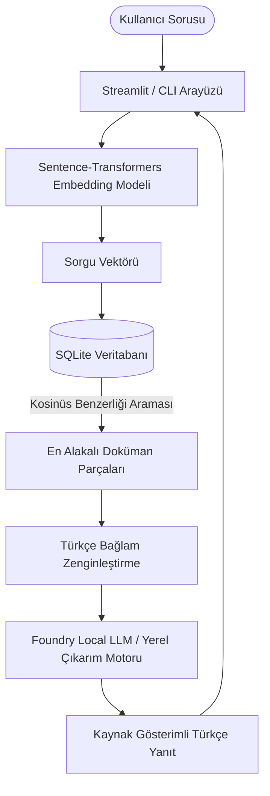

# Microsoft Online Yaz Stajı: Yerel RAG (Foundry Local) Sohbet Asistanı

Bu proje, **Microsoft Online Yaz Stajı** kapsamında geliştirilmiş, **Microsoft Foundry Local** mimarisinden ve **SQLite** altyapısından faydalanan **çevrimdışı (offline) yerel bir Türkçe Doküman Soru-Cevap (RAG) Asistanıdır**.

Sistem, harici internet bağlantısına ihtiyaç duymadan, kullanıcıların yüklediği PDF, Word ve TXT belgelerini metin parçalarına (chunks) böler, vektör dizilerine (embeddings) dönüştürür ve SQLite veritabanına kaydeder. Kullanıcı soru sorduğunda en alakalı metin parçalarını Kosinüs Benzerliği ile çekerek kaynak gösterimli (citationlı) ve halüsinasyonsuz Türkçe yanıtlar üretir.

---

## 🎯 Proje Özellikleri

- **%100 Çevrimdışı (Offline) Çalışma**: Sıfır bulut bağımlılığı ve internet gereksinimi.
- **SQLite Vektör Depolama**: Dokümanların ve 384-boyutlu embedding vektörlerinin hızlı ve sunucusuz depolanması.
- **Kosinüs Benzerliği Araması**: Kullanıcı sorusuna en yakın metin parçalarının vektör uzayında bulunması.
- **Sorumlu Yapay Zeka (Responsible AI)**: Bilgi belgede yoksa uydurma yapmama kuralı ve her yanıtta otomatik **Kaynak Gösterimi (Citation)**.
- **Çift Arayüz Desteği**:
  1. Hızlı testler için **Konsol (CLI)** Arayüzü (`main.py`).
  2. Kullanıcı dostu, modern **Streamlit Web Arayüzü** (`app.py`).

---

## 🏗️ Sistem Mimarisi



---

## 🚀 Kurulum ve Çalıştırma Rehberi

### 1. Gereksinimleri Yükleme
```bash
pip install -r requirements.txt
```

### 2. Konsol (CLI) Arayüzünü Çalıştırma
```bash
python main.py
```

### 3. Web Arayüzünü (Streamlit) Çalıştırma
```bash
streamlit run app.py
```

---

## 📁 Proje Dosya Yapısı

- `config.py`: Proje konfigürasyonu ve sabitler.
- `main.py`: CLI konsol erişim noktası ve test çalıştırma dosyası.
- `app.py`: Streamlit Türkçe sohbet ve doküman yönetim web arayüzü.
- `src/database.py`: SQLite veritabanı yönetimi ve Kosinüs Benzerliği arama modülü.
- `src/ingestion.py`: PDF/TXT/DOCX metin işleme ve vektör dönüştürücü.
- `src/rag_engine.py`: Geri getirme (Retrieval), bağlam zenginleştirme ve Türkçe çıkarım motoru.
- `requirements.txt`: Bağımlı Python kütüphaneleri.

---

## 🎓 Staj Değerlendirme & Sunum Notları

- **Hafta 1-2**: Temel yapının ve SQLite vektör depolamasının kurulması.
- **Hafta 3-4**: Ingestion, `get_top_chunks()` ve `answer_query()` boru hattının tamamlanması.
- **Hafta 5-6**: Sorumlu yapay zeka kuralları, kaynak gösterme ve canlı demo sunum hazırlığı.
